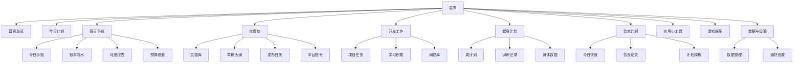

# 星隅（Stellarium）产品需求文档（PRD）

- 版本：v1.0
- 日期：2026-08-10
- 状态：已确认，作为后续开发依据

## 1. 产品目标和使用场景

### 产品目标
- 为个人打造一款「工作 + 生活」一体化的专属应用，把每日计划、手账、账本、自媒体创作、开发项目、健身和饮食记录集中在一个本地应用里。
- 强调私密、轻量、离线可用：所有数据只保存在自己的电脑上，不依赖任何外部服务。
- 名字「星隅」呼应星空主题，界面采用星空暗色风格。

### 使用场景
- 用户在自己的电脑上，用浏览器打开应用即可使用（单机、无后端）。
- 每天例行使用：查看首页总览 → 勾选今日计划 → 写手账、记账 → 记录健身 / 饮食打卡。
- 按需使用：整理自媒体灵感与草稿、管理开发项目与问题、查看月度预算报表、备份数据。

### 非目标
- 不做登录、账号体系、联网、云数据库、部署上线、手机端。
- 不做社交分享和多用户协作。

## 2. 整体页面框架和导航结构

### 整体框架
- 单页应用（SPA），在本地浏览器中运行，无后端服务。
- 布局：左侧固定侧边栏 + 右侧内容区。
- 主题：星空暗色（深蓝渐变背景、微星光点、毛玻璃卡片），默认中文。

### 导航结构
- 侧边栏：Logo「✦ 星隅」+ 10 个导航项 + 底部版本号。
- 内容区顶部：当前模块名称 + 该模块主操作按钮。

## 3. 首页的内容结构

首页自上而下包含四个区块：

1. **顶部问候**：按时段问候（早上好 / 下午好 / 晚上好）+ 当天日期。
2. **今日计划卡片**：展示今天前 5 条任务，可直接勾选完成；底部「查看全部 →」跳转今日计划模块。
3. **快速备忘卡片**：单行输入框（回车即存）+ 最近 5 条备忘，悬停可删除。
4. **模块摘要网格**（自适应 2~4 列，每张卡片可点击跳转对应模块）：
   - 手账：今日是否已写手账 + 本月预算剩余
   - 开发：进行中任务数
   - 自媒体：待发布草稿数
   - 健身：今日是否已训练
   - 饮食：今日是否已记录
   - 身体：最近一次体重

## 4. 每个模块的用途

| 模块 | 用途 |
| --- | --- |
| 首页总览 | 一天开始的入口：看今日计划、快速记备忘、总览各模块状态 |
| 今日计划 | 管理每天的任务清单，按时间段安排，支持完成、顺延、历史回看 |
| 每日手账 | 记录每天的心情、天气和文字，并内置月度预算管理与每日账本 |
| 自媒体 | 管理内容创作全流程：灵感、草稿大纲、发布日历、平台账号 |
| 开发工作 | 管理个人开发项目与任务、学习积累、问题与解决方案库 |
| 健身计划 | 安排每周训练、记录每次训练和身体数据（体重/体脂） |
| 饮食计划 | 记录每日三餐、查看历史、使用饮食模板 |
| 实用小工具 | 占位入口，展示常用工具列表，点击提示「暂未开发」 |
| 游戏娱乐 | 占位入口，展示小游戏列表，点击提示「暂未开发」 |
| 数据与设置 | 数据备份 / 恢复 / 清空，以及应用偏好设置 |

## 5. 每个模块第一版最必要的数据和操作

### 5.1 首页总览
- 数据：今日任务（只读前 5 条）、备忘（最近 5 条）、各模块摘要（实时计算）。
- 操作：勾选任务、新增 / 删除备忘、点击摘要卡跳转对应模块。

### 5.2 今日计划
- 数据：任务（日期、标题、时间段[上午/下午/晚上/全天]、优先级[高/中/低]、标签、备注、完成状态、是否顺延）。
- 操作：新增 / 编辑 / 删除任务、勾选完成、未完成任务顺延到明天、按日期切换查看历史。

### 5.3 每日手账
- 数据：
  - 手账（日期、心情、天气、正文）
  - 账目（日期、类型[支出/收入]、金额、分类、备注）
  - 预算（月份、总额）
  - 分类（名称，默认：餐饮/交通/购物/娱乐/居住/其他）
- 操作：写手账（自动保存）、记一笔 / 编辑 / 删除账目、设置每月预算、管理分类、查看月度报表（分类占比、每日支出、收支汇总）、日历点选日期查看历史。

### 5.4 自媒体
- 数据：
  - 灵感（内容、来源平台、标签、状态[待用/已采用/放弃]）
  - 草稿（标题、平台、关联灵感、大纲要点、状态[构思/写作中/待发布/已发布]、发布日期）
  - 平台账号（平台、账号名称、备注）
  - 排期（日期、草稿）
- 操作：灵感增删改 + 按状态筛选；草稿新建 / 编辑 / 状态流转（发布后回填日期）；发布日历查看 / 安排 / 取消排期；平台账号增删改。

### 5.5 开发工作
- 数据：
  - 项目（名称、状态、说明）
  - 项目任务（所属项目、标题、状态[未开始/进行中/已完成/搁置]、优先级、备注）
  - 学习主题（主题、笔记、进度百分比）
  - 问题（标题、描述、解决方案、标签、日期）
- 操作：项目增删改；项目任务增删改 + 状态切换；学习主题增删改 + 进度调整；问题增删改 + 关键字搜索。

### 5.6 健身计划
- 数据：周计划（周起始日、每天训练内容）、训练记录（日期、动作、组数、次数、重量）、身体数据（日期、体重、体脂率）、常用动作列表。
- 操作：编辑每周每天内容、复制本周到下周；新增 / 编辑 / 删除训练记录（支持常用动作快捷选择）；新增身体数据并查看体重 / 体脂趋势图。

### 5.7 饮食计划
- 数据：饮食记录（日期、餐次[早/中/晚/加餐]、内容、热量估算）、计划模板（名称、说明、适用目标、三餐内容）。
- 操作：记录 / 编辑每餐内容；查看历史记录；新建模板、将模板套用到今天。

### 5.8 实用小工具
- 数据：工具占位列表（计算器、单位换算、番茄钟、随机抽签、掷骰子、备忘便签等）。
- 操作：点击卡片 → Toast「该工具暂未开发，敬请期待」。

### 5.9 游戏娱乐
- 数据：游戏占位列表（2048、扫雷、数独、贪吃蛇、井字棋等）。
- 操作：点击卡片 → Toast「该功能暂未开发，敬请期待」。

### 5.10 数据与设置
- 数据：设置项（应用名称、主题[星空暗色/极简浅色]、预算默认分类、日期格式）。
- 操作：导出备份 JSON、导入备份（覆盖前自动备份当前数据）、清空所有数据（输入「清空」确认）、切换主题（即时生效并记住）。

## 6. 首页、今日计划和各模块之间的关系

- 首页是聚合入口：实时读取今日计划与各模块数据，展示摘要；点击摘要卡跳转到对应模块。
- 今日计划是首页的核心数据源之一：首页展示前 5 条任务；在首页或今日计划中勾选任务，两处同步更新。
- 快速备忘独立存放，仅首页展示和编辑。
- 各模块数据流向首页摘要：
  - 手账记账 → 首页「本月预算剩余」更新。
  - 草稿标记已发布 → 首页「待发布草稿数」减少，自媒体发布日历出现排期。
  - 新增训练记录 → 首页「今日是否已训练」变为已训练。
  - 新增饮食记录 → 首页「今日是否已记录」变为已记录。
  - 新增身体数据 → 首页「最近体重」更新。
- 模块内部联动：
  - 预算设置的分类 → 账本流水的分类下拉选项。
  - 草稿关联灵感 → 该灵感状态自动变为「已采用」。

## 7. 本地数据文件、备份和恢复要求

- 所有数据保存在当前电脑浏览器的本地数据库中（IndexedDB），无后端、无网络请求。
- 刷新页面、关闭页面、重启浏览器和电脑后数据都不丢失。
- 导出备份：一键下载 JSON 备份文件，包含全部数据 + 导出时间，用于自行存档。
- 恢复：导入备份文件，导入前先校验格式；覆盖前自动把当前数据另存为一份备份。
- 清空：提供「清空所有数据」操作，必须输入「清空」两字才能执行，执行后回到首页。
- 提示：数据仅存在于本机浏览器，清除浏览器数据会删除数据，因此建议定期导出备份。

## 8. 第一版必须完成的功能

- 首页总览：问候、今日计划前 5 条（可勾选）、快速备忘、6 张模块摘要卡（可点击跳转）。
- 今日计划：任务完整增删改查、勾选完成、优先级与标签、时间段分组、按日期查看历史、未完成任务顺延到明天。
- 每日手账：每日心情 / 天气 / 正文（自动保存）；月度预算设置与分类管理；每日收支记账；月度汇总报表（分类占比、每日支出、收支汇总）；预算超支提醒（进度条状态：正常 / 紧张 / 超支）。
- 自媒体：灵感库（含状态流转）、草稿大纲（含状态流转与发布回填）、发布日历（查看 / 安排 / 取消排期）、平台账号管理。
- 开发工作：项目管理 + 项目内任务四态；学习主题 + 进度；问题库 + 搜索。
- 健身计划：周计划编辑与复制到下周；训练记录（含常用动作）；身体数据与趋势图。
- 饮食计划：三餐 + 加餐记录与总热量；历史查看；模板新建与套用。
- 实用小工具、游戏娱乐：占位入口界面 + 「暂未开发」Toast 提示。
- 数据与设置：导出 / 导入 / 清空数据；主题切换；应用名称与预算分类设置。
- 本地持久化：以上所有数据刷新、关闭、重启后不丢失。
- 全局交互：删除二次确认、空状态引导、Toast 反馈、表单校验。

## 9. 第一版暂时不做的功能

- 实用小工具和游戏娱乐的实际功能。
- 登录、账号、联网、云数据库、云同步、部署上线、手机端 / 响应式移动布局。
- 推送提醒 / 浏览器通知。
- 多设备同步、多用户。
- 数据加密。
- 复杂报表和高级图表（第一版仅做分类占比、每日支出、体重 / 体脂趋势等基础图表）。
- 发布日历拖拽排期（第一版用按钮操作）。
- 图片 / 附件上传、富文本编辑。

## 10. 可以实际检查的验收标准

以下标准在本地浏览器中实际打开应用即可逐条验证：

### 整体
- 打开应用后无任何网络请求，离线可用。
- 侧边栏包含 10 个导航项，点击可切换到对应模块，当前项高亮。
- 新增任意数据后刷新页面、关闭浏览器重新打开，数据仍然存在。
- 删除操作有二次确认；清空数据需输入「清空」才能执行。

### 首页总览
- 首页显示问候语与当天日期。
- 今日计划卡片显示今天前 5 条任务，勾选后任务划掉，且今日计划模块中同步为已完成。
- 快速备忘输入后回车立即保存并出现在列表；悬停可删除。
- 6 张摘要卡显示正确数值，点击后跳转到对应模块。
- 在手账记账后回到首页，预算剩余摘要同步更新。

### 今日计划
- 可新增任务（标题必填），支持时间段、优先级、标签、备注。
- 任务按时间段分组展示；勾选完成移入已完成区。
- 切换日期可查看历史任务；「顺延到明天」将今日未完成任务复制到明天并标记已顺延。

### 每日手账
- 可写手账：选心情、选天气、写正文，正文自动保存并显示「已保存 HH:mm」。
- 可设置当月预算；可管理分类（增删改），分类出现在记账下拉中。
- 记一笔（支出 / 收入、金额、分类、备注）后，流水列表和顶部预算条实时更新。
- 当月支出超过预算时进度条变红并提示超支金额。
- 月度报表展示分类占比、每日支出、收支汇总。
- 月历上有手账或记账的日期有标记，点击可查看该日内容。

### 自媒体
- 可新增灵感，按状态（待用 / 已采用 / 放弃）筛选。
- 可新建草稿并关联灵感，关联后灵感自动变为「已采用」。
- 草稿状态可流转到「已发布」并填发布日期，发布日历对应日期出现「平台 + 标题」标签。
- 可安排 / 取消发布排期；可新增、编辑、删除平台账号。

### 开发工作
- 可新建项目并进入详情，在项目下新增任务，任务可在四种状态间切换。
- 可新增学习主题，调整进度百分比并即时保存。
- 可新增问题（描述 + 解决方案 + 标签），搜索关键字能过滤出对应问题。

### 健身计划
- 可编辑周一到周日每天的训练内容，可「复制本周 → 下周」。
- 可新增训练记录（日期、动作、组数、次数、重量），常用动作可快捷选择。
- 可新增体重 / 体脂数据，趋势图随之更新。

### 饮食计划
- 可记录早 / 中 / 晚 / 加餐的内容与热量，顶部总热量实时累加。
- 可查看历史饮食记录；可新建模板并将模板内容套用到今天。

### 实用小工具与游戏娱乐
- 两个模块均显示占位入口卡片，点击任意卡片出现「暂未开发」提示，不报错、不跳转空白页。

### 数据与设置
- 导出可下载 JSON 备份文件；导入该文件后数据完整恢复。
- 导入格式错误的文件时提示「备份文件格式不正确」，不破坏现有数据。
- 切换主题即时生效，刷新后保持。
- 执行清空后全部数据消失并回到首页。