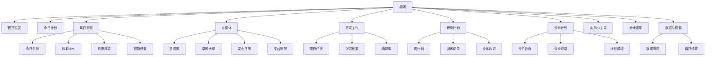

# 星隅（Stellarium）页面结构设计 v0.1

## 1. 整体框架

- 单页应用（SPA），在本地浏览器中运行，无后端。
- 布局：左侧固定侧边栏 + 右侧内容区。
- 主题：星空暗色（深蓝渐变背景、微星光点、毛玻璃卡片），默认语言中文。
- 侧边栏自上而下：Logo「✦ 星隅」、10 个导航项、底部版本号。

## 2. 信息架构（导航树）



## 3. 页面布局线框

### 3.1 首页总览

```
┌──────────┬──────────────────────────────────────────┐
│ 侧边栏    │  晚上好，星主 · 8月10日 星期一              │
│ ┌──────┐ │  ┌ 今日计划 ───────────────────────────┐ │
│ │✦首页  │ │  │ ☐ 上午 整理需求文档    [高]          │ │
│ │今日计划│ │  │ ☑ 下午 跑步 30 分钟                 │ │
│ │每日手账│ │  │             查看全部 →              │ │
│ │自媒体  │ │  └──────────────────────────────────┘ │
│ │开发工作│ │  ┌ 快速备忘 ────────────────────────┐ │
│ │健身计划│ │  │ [写点什么…]                     ＋ │ │
│ │饮食计划│ │  │ • 明天交房租                       │ │
│ │小工具  │ │  │ • 给妈妈买生日礼物                 │ │
│ │游戏娱乐│ │  └──────────────────────────────────┘ │
│ │数据设置│ │  ┌摘要┐┌摘要┐┌摘要┐┌摘要┐            │
│ └──────┘ │  │手账││开发││媒体││健身│            │
│  v0.1    │  └────┘└────┘└────┘└────┘            │
└──────────┴──────────────────────────────────────────┘
```

区块：
- 顶部问候：按时段（早上好/下午好/晚上好）+ 当天日期。
- 今日计划卡片：展示前 5 条任务，可直接勾选；底部「查看全部 →」跳转今日计划。
- 快速备忘卡片：单行输入框（回车即存）+ 最近 5 条备忘，悬停可删除。
- 摘要网格（自适应 2~4 列）：手账（今日已记/未记 + 本月预算剩余）、开发（进行中任务数）、自媒体（待发布草稿数）、健身（今日是否训练）、饮食（今日是否已记录）、身体（最近体重）。每张卡片：图标 + 标题 + 一行摘要，点击跳转对应模块。

### 3.2 今日计划

- 顶部工具条：日期切换（← 日期 →）、「今天」按钮、日历弹层；跨天查看历史计划。
- 任务列表：按时间段分组（上午 / 下午 / 晚上 / 全天）。
  - 每条任务：勾选框、标题、时间、优先级色点（高红/中黄/低灰）、标签；完成态划线置灰。
  - 悬停显示「编辑 / 删除」。
- 底部：新增任务按钮；「未完成任务顺延到明天」按钮。
- 已完成区：默认折叠，可展开查看当天已完成任务。

### 3.3 每日手账（4 个 Tab）

- 顶部常驻预算条：`预算 ¥3000 | 已用 ¥1250 | 剩余 ¥1750`，带进度条；超支变红并提示「本月已超支 ¥xx」。
- Tab 1 今日手账：心情（5 个 emoji 单选）+ 天气（下拉）+ 正文（多行文本，自动保存，右上角显示「已保存 HH:mm」）；下方为今天账目快速列表 + 「记一笔」。
- Tab 2 账本流水：「记一笔」按钮（类型 支出/收入、金额、分类、备注）；流水按日期分组，支出红 / 收入绿，可编辑删除。
- Tab 3 月度报表：分类占比环形图、每日支出柱状图、收支汇总（总收入/总支出/结余）。
- Tab 4 预算设置：本月预算金额输入；分类管理（增删改，默认：餐饮/交通/购物/娱乐/居住/其他）；日历视图——有记账/手账的日期打点，点击日期切回当日手账。

### 3.4 自媒体（4 个 Tab）

- Tab 1 灵感库：卡片列表（灵感内容、来源平台、标签、状态：待用/已采用/放弃）；「新增灵感」；按状态筛选。
- Tab 2 草稿大纲：列表（标题、平台、状态：构思/写作中/待发布/已发布）；「新建草稿」打开编辑面板（标题、平台、关联灵感、大纲要点、状态）；已发布草稿可填发布日期回填日历。
- Tab 3 发布日历：月历视图，排期日期显示「平台 + 标题」小标签；点击日期查看当日排期；「安排发布」选择日期 + 草稿。
- Tab 4 平台账号：账号卡片（平台图标、账号名称、备注）；「新增账号」。

### 3.5 开发工作（3 个 Tab）

- Tab 1 项目任务：项目卡片（名称、进度条、状态色），点击进入项目详情页（返回按钮 + 任务清单；任务状态：未开始/进行中/已完成/搁置；可新增/编辑/删除任务）。
- Tab 2 学习积累：主题列表（技术主题、笔记摘要、进度百分比）；「新增主题」；点击展开笔记详情。
- Tab 3 问题库：顶部搜索框 + 问题列表（问题标题、标签、日期）；「新增问题」→ 详情（问题描述、解决方案、标签）。

### 3.6 健身计划（3 个 Tab）

- Tab 1 周计划：周一至周日 7 格网格，每天显示训练内容（如「胸+三头」）；点击格子编辑当天内容；支持「复制本周 → 下周」。
- Tab 2 训练记录：「新增记录」（日期、动作、组数、次数、重量）+「常用动作」快捷选择；历史按日期分组。
- Tab 3 身体数据：「新增记录」（体重、体脂率）；体重/体脂折线趋势图。

### 3.7 饮食计划（3 个 Tab）

- Tab 1 今日饮食：早 / 中 / 晚 / 加餐 4 张卡片，每张可记录内容与热量估算；顶部今日总热量汇总条。
- Tab 2 饮食记录：历史记录按日期分组，点击查看某天详情。
- Tab 3 计划模板：模板卡片（名称、说明、适用目标：增肌/减脂/均衡）；「套用到今天」；「新建模板」。

### 3.8 实用小工具

- 网格卡片（6~9 个占位）：计算器、单位换算、番茄钟、随机抽签、掷骰子、备忘便签等。
- 卡片带「即将上线」角标；点击 Toast「该工具暂未开发，敬请期待」。

### 3.9 游戏娱乐

- 网格卡片（占位）：2048、扫雷、数独、贪吃蛇、井字棋等。
- 点击同样提示「暂未开发」。

### 3.10 数据与设置

- 数据管理卡片：导出备份（下载 JSON）、导入备份（选择文件，覆盖前先自动备份当前数据）、清空所有数据（需输入「清空」确认）。
- 偏好设置：应用名称、主题（星空暗色默认 / 极简浅色）、预算默认分类管理、日期格式。
- 关于：版本 v0.1、数据存储说明（全部保存在本机浏览器）。

## 4. 模块间联动

- 首页摘要 ← 各模块实时数据（今日计划勾选、手账记账、草稿待发布数、健身/饮食今日打卡、最近体重）。
- 预算分类（预算设置）→ 账本流水下拉选项。
- 草稿标记「已发布」→ 发布日历出现对应排期。
- 训练记录 → 首页「今日是否训练」判断。
- 饮食记录 → 首页「今日是否已记录」判断。